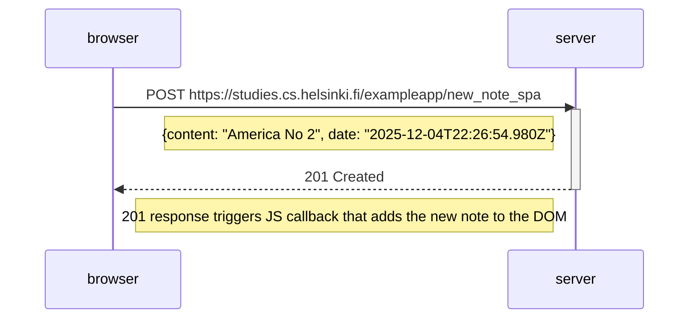

# Exercise 0.6

# New note in Single page app diagram

# User creates a new note using the single-page version of the app.

```mermaid
sequenceDiagram
    participant browser
    participant server

    browser->>server: POST https://studies.cs.helsinki.fi/exampleapp/new_note_spa
    activate server
    Note left of server: {content: "America No 2", date: "2025-12-04T22:26:54.980Z"}
    server-->>browser: 201 Created
    deactivate server
    Note right of browser: 201 response triggers JS callback that adds the new note to the DOM
```
